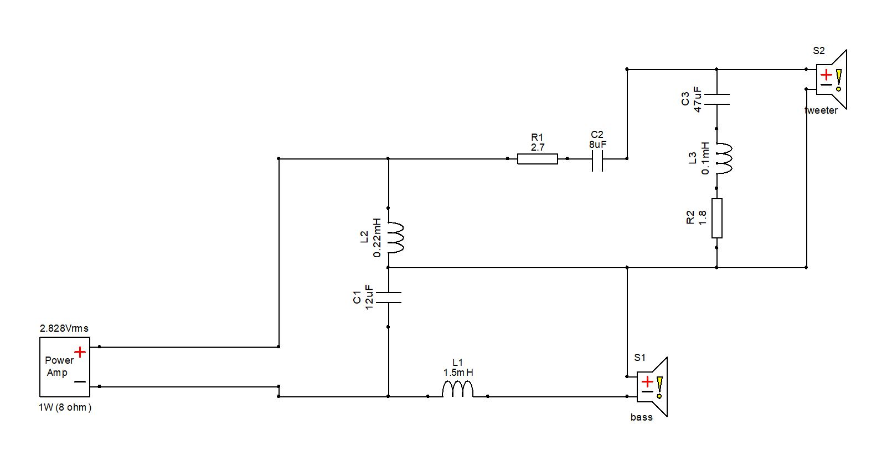

# Bookshelf 1

This is a simply bookshelf speaker, based on a COAX driver from SB Acoustics. The cabinet are a bass reflex cabinet to increase the bass response.

## License
This project and all it's work are licensed under the [CERN Open Hardware Licence Version 2](https://ohwr.org/project/cernohl/wikis/Documents/CERN-OHL-version-2) license.

## Design goals

Initial design goals for this bookshelf speaker:

* Use a COAX driver for optimal timing between drivers
* Compact cabinet
* In room bass extention into the 40Hz range

## Current progress

Prototype cabinet have been designed and built. Initial measurements are been captured. Find them under the [measurements](measurements) folder.

Working on the finishing of the cabinet. Going with a painted finish and initially no driver cover.

An initial crossover have been designed, based on the captured measurements. I'm going for a 2nd order series filter. Currently it looks as depicted below.

The currently simulated results of the speaker + filter looks like this. This result will need to be confirmed by a measurement once the components have arrived.
