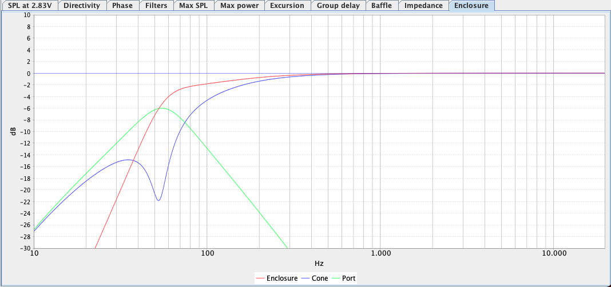
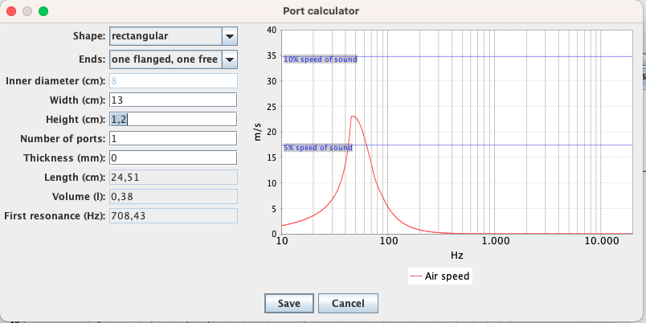

Cabient design
##############

The speaker cabinet are designed as a bass reflex design, to try to increase the bass extension. As this is a fairly small form factor, the port has to be rather long.

Cabinet design
**************

We are going for a small box with this project. It is a bookshelf speaker after all. Around 6l of internal cabient volume.
It will be built of 12mm MDF or similar material.

The baffle will be constructed as a sandwich of two layers. So 24mm in thickness.

We have used an open source project called `SpeakerSim <https://lightbit.gitlab.io/file/>`_ for the simulations. The project file can be downloaded below.

The simulation looks like this, giving us a -6dB output level at the port tuning frequency.

Port design
***********

With this port we are trying to tune it as low as the box will allow us. As seen above this gets us to around 53Hz. This tuning frequency requires a rather long port, as this is a small box.

The port is a slot type port and to make it fit inside the cabinet it needs to have a bend; more or less in the middle. The result are a port slot with a lenght of about 25cm. A port that almost travels the entire buttom and back of the inside of the cabinet.

To make the port fit inside the cabinet -- and avoiding a second bend -- it also have to be rather narrow (a larger diameter will require an even longer port). This increases the air velocity in the port at high output levels, which will result in port noises.
We are trying to mitigate/limit these effects by adding a flare to each end of the port slot.

Downloads
*********

* Download the SpeakerSim project in .ssim format :download:`bookshelf.ssim <../../../bookshelf.ssim>`.