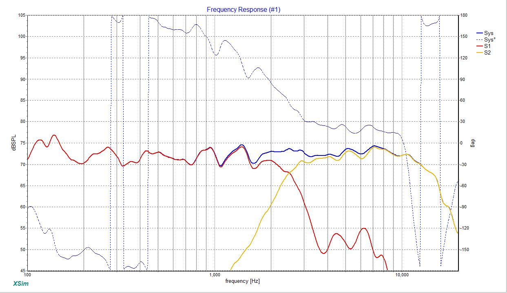

Speaker crossover
#################

The crossover have been simulated and modelled in XSim. The crossover file linked below contains the filter simulation.
The measurements used doesn't include impendance measurements.

We are going for a crossover frequence of around 2500Hz. This to keep a reasonable wide dispersion for the entire frequency range.

As seen in the driver measurements (can be downloaded below) the bass driver has various issues above the crossover frequency wich require us to ensure that these are lowered enough, to not make an audible impact in the tweeter section.

Crossover layout
================

The crossover is a 2-way series and is of 2nd order.

.. image:: ../../../crossover/crossover.jpg
   :alt: 2nd order crossover

Simulated result
==========================

The above crossover have been simulated and constructed in XSim. With the above values the simulation results in the below frequency response:

Measured result
===============

This is the resulting measurement after I have fittet the crossover (version 2).

.. chart:: measurements/crossover-v2.json

    Measured frequency response of an initial test cabinet and test crossover (v2). As this is an in room measurement, the bass section and phase result can't be expected to be 100% correct.

Downloads
=========

* Download the XSim crossover design in .DXO format :download:`2-way_LR_eries.dxo <../../../crossover/2-way_LR_eries.dxo>`.
* Download the measurements for the bass driver in .MDAT (Room EQ Wizard) format :download:`bass baseline.mdat <../../../measurements/20230805/bass baseline 71.mdat>`.
* Download the measurements for the tweeter in .MDAT (Room EQ Wizard) format :download:`tweeter baseline.mdat <../../../measurements/20230805/tweeter baseline 72.mdat>`.