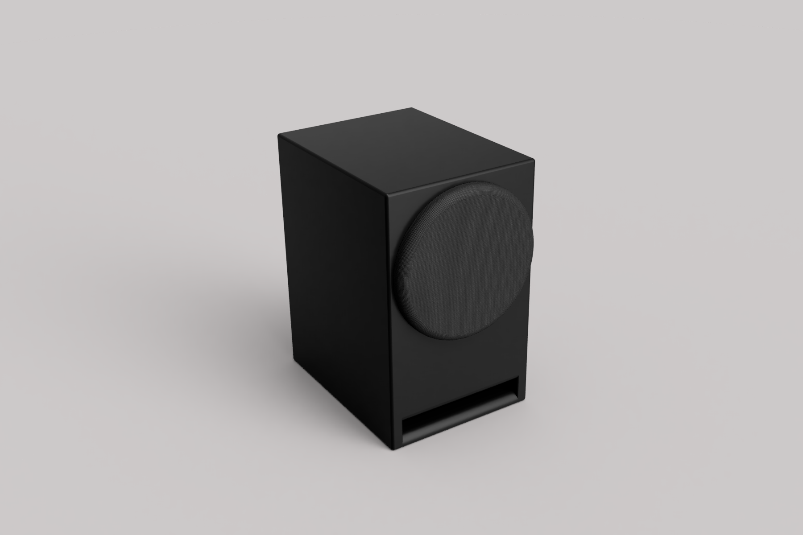

.. Bookshelf 1 documentation master file, created by
   sphinx-quickstart on Tue Aug  8 17:27:13 2023.
   You can adapt this file completely to your liking, but it should at least
   contain the root `toctree` directive.

###########
Bookshelf 1
###########

This is a simply bookshelf speaker, based on a COAX driver from SB Acoustics.
The cabinet are a bass reflex design; which helps to increase the bass response.

.. toctree::
  :caption: Documentation Sections
  :maxdepth: 1

  cabinet
  crossover
  contributing
  license
  changelog

.. Indices and tables
   ==================

   * :ref:`genindex`
   * :ref:`modindex`
   * :ref:`search`
